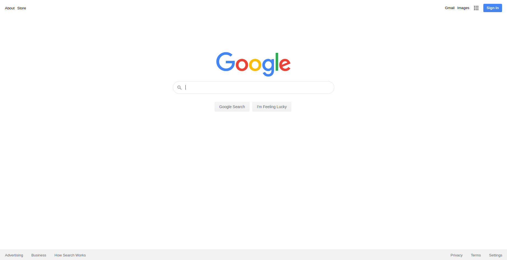

<h4 align="center">

</h4>

## Google HomePage
Simple visual clone of the google home page.

## Description
Simple visual clone of the google homepage made with HTML and CSS. The goal was to visually copy all the elements on the default google homepage and all the CSS effects. 

## Why?
The point of this project was to practice basic HTML and CSS to make a page that looked exactly like the google homepage. This project helped to practice basic HTML structuring of a page and basic CSS such as positioning/aligning elements, setting width/height, and adding simple CSS effects like hover. This was also a fun opportunity to play with chrome dev tools to inspect how a page was made and how to troubleshoot making a simple page.